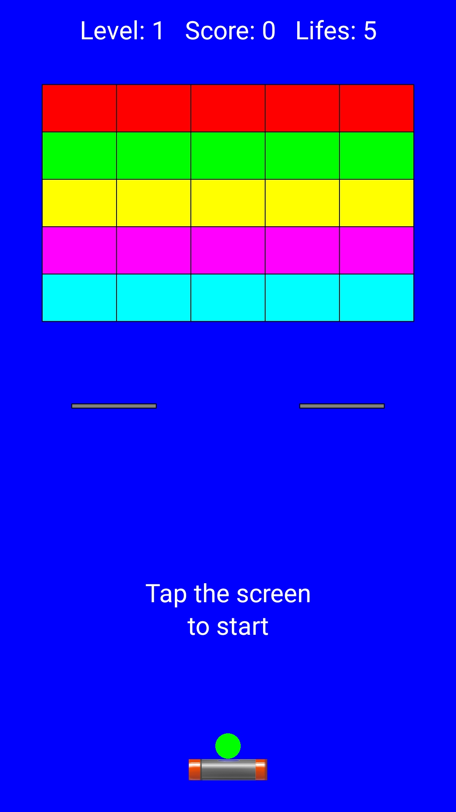
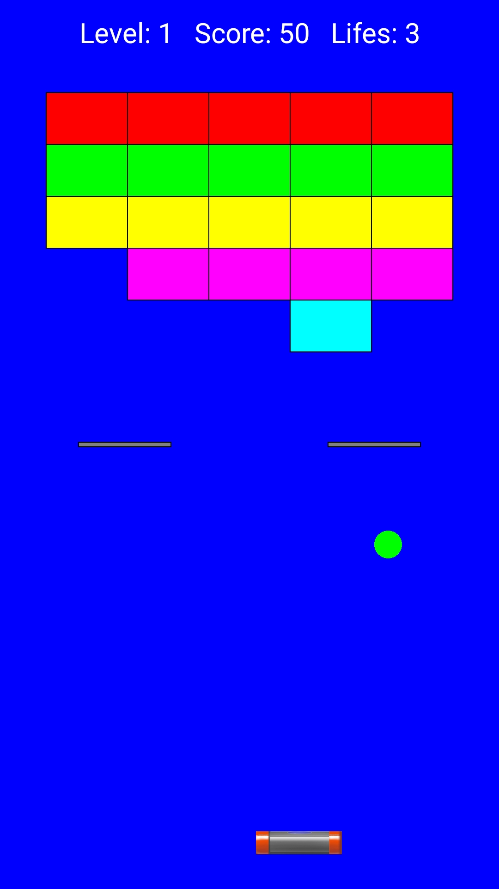
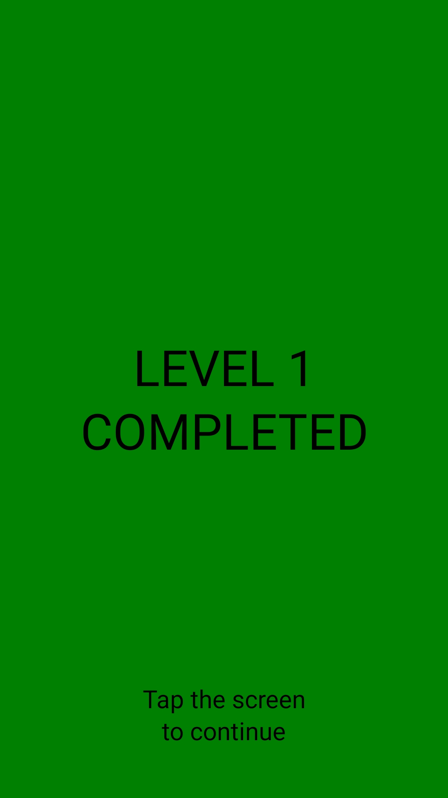
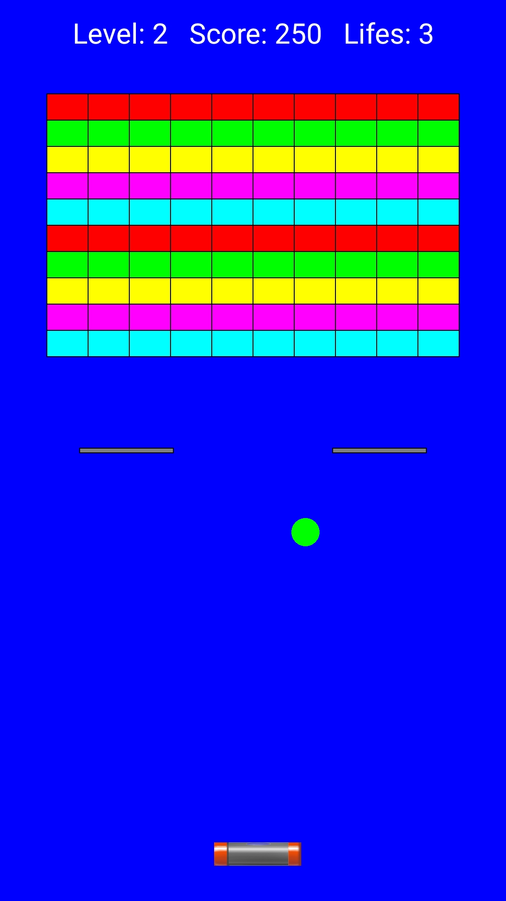
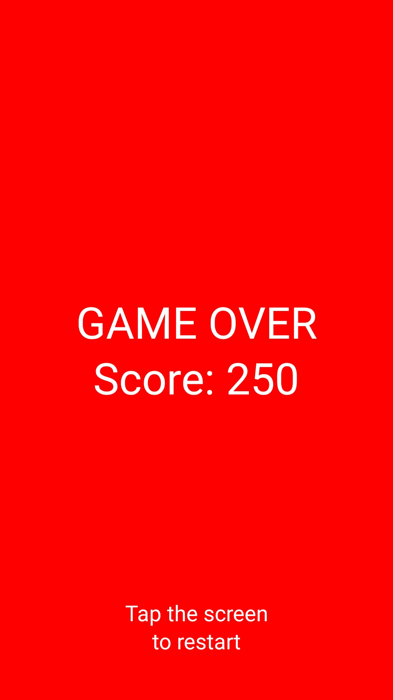

# Arkanoid
Typical Arkanoid game for Android

## Table of contents
* [General info](#general-info)
* [Screenshots](#screenshots)
* [Technologies](#technologies)
* [Setup](#setup)

## General info
Project made for the subject Applications for Mobile Devices on the Universitat de Valencia during my Erasmus+ exchange. The project was made to get familiar with prototyping mobile applications using Processing.

## Screenshots

## Technologies
* Processing - version 3.5.4

## Setup
The game can be run on Processing using Android mode. After running in Processing the game will be installed on your Android device.

